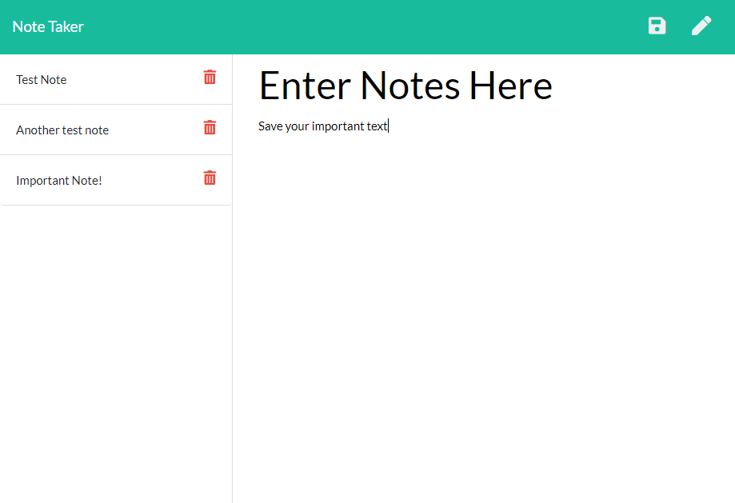

# Employee Summary Generator

## Description
This is a note taking app that users can store important notes on.  It enables saving of note name as well as any important text.

## Table of Contents
* [Installation](#installation)
* [Usage](#usage)
* [Credits](#credits)
* [License](#license)
* [Contributing](#Contributing)
* [Tests](#Tests)
* [Questions](#Questions)

## Installation
Clone this repository and run command "npm install" to get dependencies

## Usage
### To run locally
Enter the command "node server.js" to start application and navigate to localhost:8080 in your browser
### Use on Heroku
[Heroku Application](https://dry-tundra-62010.herokuapp.com/notes)

## License
This repository is licensed under the MIT license

## Contributing
No additional contributions are expected for this application

## Tests
There are currently no test for this application

## Questions
#### For any questions about this repository send an email to kory.nelson99@gmail.com
#### View my full GitHub at [https://github.com/korynelson](https://github.com/korynelson)

